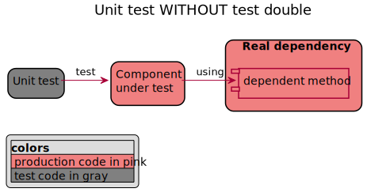
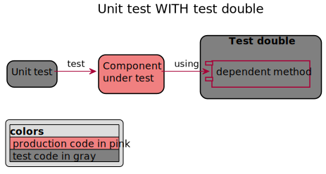

# A guide to test double your Node.js code

**Table of content**

- [A guide to test double your Node.js code](#a-guide-to-test-double-your-nodejs-code)
  - [TL;DR:](#tldr)
  - [1. Are you mocking me? An introduction to test double](#1-are-you-mocking-me-an-introduction-to-test-double)
    - [What is a test double?](#what-is-a-test-double)
    - [Stop talking about mock](#stop-talking-about-mock)
    - [Types of test double in theory](#types-of-test-double-in-theory)
    - [Test double in real life with Node.js](#test-double-in-real-life-with-nodejs)
  - [2. Choose your way to test double](#2-choose-your-way-to-test-double)
    - [Partial test double (without module interception)](#partial-test-double-without-module-interception)
    - [Full test double (with module interception)](#full-test-double-with-module-interception)
  - [3. Choose the right tool](#3-choose-the-right-tool)
    - [Overview of Javascript test libraries](#overview-of-javascript-test-libraries)
    - [8 samples on how to mock with different libraries](#8-samples-on-how-to-mock-with-different-libraries)
    - [Test Doubles implementations across libraries](#test-doubles-implementations-across-libraries)
    - [Specificities of each libraries](#specificities-of-each-libraries)
  - [Conclusion](#conclusion)
  - [References](#references)


(Fake cover generated on [O RLY Cover Generator](https://dev.to/rly))

---

## TL;DR:

This guide help you to anwser those questions:

**Should I use a spy or a stub?**

In real life both useful types of mocks with different purpose.

- Spies to keep the behavior of your dependency and track the usage.
- stubs to replace the behavior of your dependency in order to check you system under test.

**Should I use 'module interception'?**

Module interception is the way to make full test double.

- For spy you simply can't use 'module interception', use a simple stubbing tool.
- For stubs the best practice it to use module interception, but you can do without.

**Which library should I use?**

This matrix should help you to make your choice:  
[Specificities of each libraries](#specificities-of-each-libraries)

```txt
My preferred library stay Jest:
  - It's integrated
  - You can use with or without module interception
  - There is no surprise on the result.
```

**Can I have a basic example for each library?**

Pick the sample code you need:

- [Jasmine][jasmine]
- [Jest no interception][jest-no-int]
- [Mocha + Chai + Sinon][sinon]
- [Jest with interception][jest-int]
- [Mocha + Chai + Sinon + proxyquire][proxyquire]
- [Mocha + Chai + Sinon + rewire][rewire]
- [Mocha + Chai + Sinon + rewiremock][rewiremock]
- [Mocha + Chai + testdouble][testdouble]

---

Now if you want more details, let's start...

## 1. Are you mocking me? An introduction to test double

My goal in this guide is to go from theory to practice about tests double in Node.JS. I'll try to cover those questions:

- Should I use a spy or a stub?
- What is module interception?
- Which javascript library should I use?

### What is a test double?

Let's go back to the basics...

_Definition of Test doubles (from Wikipedia)_:
In automated unit testing, it may be necessary to use objects or procedures that look and behave
like their release-intended counterparts, but are actually simplified versions that reduce the
complexity and facilitate testing.
A test double is a generic (meta) term used for these objects or procedures.





### Stop talking about mock

Mock is sometimes used to refer to all type of **test doubles**, but in fact **mock** is just one type of test doubles. It's why I'll try to use '_test double_' and not '_mock_' in this guide (as a noun and as a verb).

### Types of test double in theory

| Types of test double | intended<br>to be used | can get<br>usage info | implementation<br>replacement | implementation<br>contains checks |
| :------------------- | :--------------------: | :-------------------: | :---------------------------: | :-------------------------------: |
| Dummies              |           -            |           -           |               -               |                 -                 |
| Spy                  |           X            |           X           |               -               |                 -                 |
| Stub                 |           X            |           X           |            static             |                 -                 |
| Fakes                |           X            |           X           |            complex            |                 -                 |
| Mock                 |           X            |           X           |               X               |                 X                 |

Test doubles is a general term to refer to different type of objects. This list describe 5 of the most used by order of complexity:

- Dummies: simple implementation of an interface. It's not intended to be used by your system under test.
- Spy: (or Test Spy) get information on dependency usage without changing the behavior. (Number of call, arguments)
- Stub: (= Dummy + static implementation) test double with modification of the behavior in order to test your component.
- Fakes: (= stub + implementation) A stub that implement some business logic. e.g. A simulator is a kind of complex fake.
- Mock: (= stub + internal test) test double which is aware about the test (with some test assertion for example).

**Be carful**: Mock as this type of specific type of test double built specifically for your test is in fact consider as an **_anti-pattern_** most of the time. It breaks the AAA (Arrange Act Assert) test structure. You should probably consider to replace it with a stub or a fake.

### Test double in real life with Node.js

| Types of test double |  in Node.js real life use   |
| :------------------- | :-------------------------: |
| Dummies              |    Nothing, it's useless    |
| Spy                  |             Spy             |
| Stub                 |            Stub             |
| Fakes                |            Stub             |
| Mock                 | Don't use them, prefer Stub |

**Dummies** are not really useful in javascript, because there is no need to implement any fixed interface. Therefore you'll never have to implement test doubles if it's not intended to be used in your component under test.

**Spies** are non invasive test double provided by almost all the testing frameworks. You could technically implement a spy yourself but it's really not worth it.

**Stubs** are invasive test double provided by almost all the testing frameworks. You could technically implement a stub yourself but it's really not worth it. With most libraries

**Fakes** are just smart stubs, their implementation is smarter and fully functional in contrast to a stub which have a very basic implementation (static most of the time). We'll consider Fakes and stub as one category.

**Mocks** are just stubs with some awareness of your test. Mocks are not the first type of test double to consider. Sinon have special objects for this, on other frameworks you need to use stubs.

## 2. Choose your way to test double

Test doubles in javascript can be achieved at 2 different levels: _Partial test double_ and _full test double_.

With **Partial test double** you are just replacing a small part of your real dependency. For doing so you need a simple library named **'Subbing library'**. _Sinon_ is the most well known library to only do subbing.

With **Full test double** you are replacing the a full javascript module with your own version for test, not just a small part. For doing so you need a more complex library named **'module interception library'**.

### Partial test double (without module interception)


This is the only way to get a real **spy**, a spy that have the original behavior of your dependency. Module interception will not be able to give you a real spy.

If you need a stub, you can get one with a simple _Subbing library_
but it's consider as an **anti-pattern** (for stubs prefer Full test double).
[Explanation from Justin Searls the creator of testdouble](https://github.com/testdouble/contributing-tests/wiki/Partial-Mock)

**Step by step**:

1. Import your component under test (of course)
2. Import the component dependency
3. Replace each method dependency with your method spy or stub.

For this you just need a test doubles library. It's named **partial test double** because you are keeping the behavior of all your dependency except the part you want to spy or stub.

### Full test double (with module interception)


This is the best way to stub your dependency in a clean way. To make a full stub you need a javascript module interception library.

**Step by step**: The way to intercept the module dependency in your component under test will not be the same depending on the library but the only common point is that you SHOULD NOT import the component dependency directly.

See example with:

- [Jest](./jest-with-interception/test/moduleA.stub.spec.js)
- [proxyquire](./sinon-with-interception-proxyquire/test/moduleA.stub.spec.js)
- [rewire](./sinon-with-interception-rewire/test/moduleA.stub.spec.js)
- [rewiremock](./sinon-with-interception-rewiremock/test/moduleA.stub.spec.js)
- [testdouble](./testdouble-with-interception/test/moduleA.stub.spec.js)

It's named **full test double** because you are not keeping anything of your original dependency behavior.

Spying in a **full test double** is not possible, because by intercepting the javascript dependent module you are not importing the original module at all. You have to stub each method of your dependency used by your system under test. If you forget to stub one, the module interception library should throw an exception. ([It's not the case for all libraries](#specificities-of-each-libraries))

For module interception, you should take care of the type of import (CommonJS, ES6 default import, ES6 named import). CommonJS is the easier to use than ES6 Modules. Make full stub in ES6 can be tricky.
See this article for more explanation: [Jest Full and Partial Mock/Spy of CommonJS and ES6 Module Imports](https://codewithhugo.com/jest-mock-spy-module-import/)

## 3. Choose the right tool

There plenty of test libraries in javascript for different purpose. Some are made to be used together some not. For Test Doubles purpose we'll be interested by only those types of tools: stubbing library and Module interception library.

### Overview of Javascript test libraries

To perform your 'test double' tests, you'll need those 4 features: a test runner, an assertion library, a test double creator, Module interceptor. If you just want to create spies, you just need the 3 firsts ones. If you want to create a stub, you need all.

| Library / purpose | Test runner | Assertion Lib | Test double creator | Module<br>interceptor |
| :---------------- | :---------: | :-----------: | :-----------------: | :-------------------: |
| jest              |      X      |       X       |          X          |           X           |
| jasmine           |      X      |       X       |          X          |           -           |
| mocha             |      X      |       -       |          -          |           -           |
| chai              |      -      |       X       |          -          |           -           |
| should.js         |      -      |       X       |          -          |           -           |
| expect.js         |      -      |       X       |          -          |           -           |
| better-assert     |      -      |       X       |          -          |           -           |
| sinon             |      -      |       -       |          X          |           -           |
| testdouble        |      -      |       -       |          X          |           X           |
| proxyquire        |      -      |       -       |          -          |           X           |
| rewire            |      -      |       -       |          -          |           X           |
| mock-require      |      -      |       -       |          -          |           X           |
| rewiremock        |      -      |       -       |          -          |           X           |

Some tool are like a swiss army knife for tests (like Jest) doing a lot of different task so you'll find them in multiple categories. There are also some compatibility issue between tools and platform (ES and CommonJS).

Let's define each feature...

**Test runner**: The test runner helps to find tests in your code, launch test, generate and display test progress and results.
The main one are: Jest, Mocha, Jasmine.

**Assertion Lib**: The assertion helps to check the test results.
It's already included in Jest and Jasmine. If you don't use those library you (and probably mocha as test runner) you can pick _chai_ or should.js, expect.js, better-assert.The most popular stack are Jest or mocha+chai.

**Test doubles creator**: We are arriving to our main subject: test doubles.
In this section we are only talking about way to provide spies and stubs.
Full test doubles are often used with javascript module interception but it's an add-on.
The main libraries are: Jest, Sinon, Jasmine, Testdouble (the library, not the concept).

**Module interception libraries**: This type of library will help you to replace a module dependency in you javascript. Each one have a very different way to do it. Module interception is sometimes named: 'Dependency mocking', 'overriding dependencies during testing', 'mocking of Node.js modules', 'mock require statements in Node.js'.

Tools: The main one are: Proxyquire, Rewire, Mock-require, Testdouble, Rewiremock.

### 8 samples on how to mock with different libraries

In order to understand all the different combination of libraries and how to use them together, I have created the same basic example with 8 different stacks.

[jasmine]: ./jasmine-no-interception
[jest-no-int]: ./jest-no-interception
[sinon]: ./sinon-no-interception
[jest-int]: ./jest-with-interception
[proxyquire]: ./sinon-with-interception-proxyquire
[rewire]: ./sinon-with-interception-rewire
[rewiremock]: ./sinon-with-interception-rewiremock
[testdouble]: ./testdouble-with-interception

| Stack tested in this project / features            | Test runner | Assertion | Test double | Module<br>interception |
| :------------------------------------------------- | :---------: | :-------: | :---------: | :--------------------: |
| 1. [Jasmine][jasmine]                              |      X      |     X     |      X      |           -            |
| 2. [Jest no interception][jest-no-int]             |      X      |     X     |      X      |           -            |
| 3. [Mocha + Chai + Sinon][sinon]                   |      X      |     X     |      X      |           -            |
| 4. [Jest with interception][jest-int]              |      X      |     X     |      X      |           X            |
| 5. [Mocha + Chai + Sinon + proxyquire][proxyquire] |      X      |     X     |      X      |           X            |
| 6. [Mocha + Chai + Sinon + rewire][rewire]         |      X      |     X     |      X      |           X            |
| 7. [Mocha + Chai + Sinon + rewiremock][rewiremock] |      X      |     X     |      X      |           X            |
| 8. [Mocha + Chai + testdouble][testdouble]         |      X      |     X     |      X      |           X            |

Each solutions will test the following basic code. The goal is to test the module A (The system under test) which reference the module B (the dependency to test double). We'll do it with spy and stub with partial or full test double.

_`ModuleB.js`_ = the dependency to test double

```js
function DoItB() {
  return "B";
}

module.exports = { DoItB };
```

_`ModuleA.js`_ = system under test

```js
var moduleB = require("./moduleB");

function DoItA() {
  return "A(" + moduleB.DoItB() + ")";
}

module.exports = { DoItA };
```

### Test Doubles implementations across libraries

Basic syntax of spy, stub and mock in different libraries:

| Tool                                                   |             spy |            stub |          mock |
| :----------------------------------------------------- | --------------: | --------------: | ------------: |
| [Sinon](https://www.npmjs.com/package/sinon)           |     sinon.spy() |    sinon.stub() |  sinon.mock() |
| [Jest](https://www.npmjs.com/package/jest)             |    jest.spyOn() |       jest.fn() | no / use stub |
| [Jasmine](https://www.npmjs.com/package/jasmine)       | jasmine.spyOn() | jasmine.spyOn() | no / use stub |
| [testdouble](https://www.npmjs.com/package/testdouble) |       td.func() |       td.func() | no / use stub |

### Specificities of each libraries

Let's now look at some implementation details about how each libraries (use in each stacks) deal with some specific requirements.

[jasmine-spy]: ./jasmine-no-interception/test/moduleAspySpec.js#L6
[jasmine-sib]: ./jasmine-no-interception/test/moduleAspySpec.js#L17
[jasmine-dep]: ./jasmine-no-interception/test/moduleAspySpec.js#L3
[jest-no-int-spy]: ./jest-no-interception/test/moduleA.spy.spec.js#L8
[jest-no-int-sib]: ./jest-no-interception/test/moduleA.spy.spec.js#L20
[jest-no-int-dep]: ./jest-no-interception/test/moduleA.spy.spec.js#L3
[sinon-spy]: ./sinon-no-interception/test/moduleA.spy.spec.js#L9
[sinon-sib]: ./sinon-no-interception/test/moduleA.spy.spec.js#L20
[sinon-dep]: ./sinon-no-interception/test/moduleA.spy.spec.js#L4
[jest-int-spy]: ./jest-with-interception/test/moduleA.spy.spec.js#L13
[jest-int-sib]: ./jest-with-interception/test/moduleA.spy.spec.js#L22
[jest-int-dep]: ./jest-with-interception/test/moduleA.spy.spec.js#L3
[proxyquire-spy]: ./sinon-with-interception-proxyquire/test/moduleA.spy.spec.js#L19
[proxyquire-sib]: ./sinon-with-interception-proxyquire/test/moduleA.spy.spec.js#L27
[proxyquire-dep]: ./sinon-with-interception-proxyquire/test/moduleA.spy.spec.js#L14
[rewire-spy]: ./sinon-with-interception-rewire/test/moduleA.spy.spec.js#L19
[rewire-sib]: ./sinon-with-interception-rewire/test/moduleA.spy.spec.js#L27
[rewire-dep]: ./sinon-with-interception-rewire/test/moduleA.spy.spec.js#L17
[rewiremock-spy]: ./sinon-with-interception-rewiremock/test/moduleA.spy.spec.js#L19
[rewiremock-sib]: ./sinon-with-interception-rewiremock/test/moduleA.spy.spec.js#L27
[rewiremock-dep]: ./sinon-with-interception-rewiremock/test/moduleA.spy.spec.js#L14
[testdouble-spy]: ./testdouble-with-interception/test/moduleA.spy.spec.js#L19
[testdouble-sib]: ./testdouble-with-interception/test/moduleA.spy.spec.js#L29
[testdouble-dep]: ./testdouble-with-interception/test/moduleA.spy.spec.js#L14
[req1]: #what-is-module-interception
[req2]: #what-is-spy-implementation
[req3]: #what-is-siblings-method-call
[req4]: #what-is-dependency-path

| Tool                                   | [Module interception][req1] |     [Spy implementation][req2] |         [Siblings method call][req3] |              [Dependency Path][req4] |
| :------------------------------------- | --------------------------: | -----------------------------: | -----------------------------------: | -----------------------------------: |
| 1. Jasmine                             |                          NO | :confused: [FAKE][jasmine-spy] |                  [SAME][jasmine-sib] |                [r/test][jasmine-dep] |
| 2. :two_hearts: Jest no interception   |                          NO |        [SAME][jest-no-int-spy] |              [SAME][jest-no-int-sib] |            [r/test][jest-no-int-dep] |
| 3. Mocha + Chai + Sinon                |                          NO |              [SAME][sinon-spy] |                    [SAME][sinon-sib] |                  [r/test][sinon-dep] |
| 4. :two_hearts: Jest with interception |                         YES |           [FAKE][jest-int-spy] |                [ERROR][jest-int-sib] |               [r/test][jest-int-dep] |
| 5. Mocha + Chai + Sinon + proxyquire   |                         YES |         [FAKE][proxyquire-spy] |  :dizzy_face: [SAME][proxyquire-sib] | :thumbsdown: [r/sut][proxyquire-dep] |
| 6. Mocha + Chai + Sinon + rewire       |                         YES |             [FAKE][rewire-spy] |                  [ERROR][rewire-sib] |   :thumbsdown: [VarName][rewire-dep] |
| 7. Mocha + Chai + Sinon + rewiremock   |                         YES |         [FAKE][rewiremock-spy] |              [ERROR][rewiremock-sib] |             [r/test][rewiremock-dep] |
| 8. Mocha + Chai + testdouble           |                         YES |         [FAKE][testdouble-spy] | :dizzy_face: [EMPTY][testdouble-sib] |             [r/test][testdouble-dep] |

Let's explain the meaning of each column.

**Column '_Module interception_'**

You have proper module interception library when you don't have to import the original dependency in your test. But in fact there is multiple way to do module interception and each library is doing this differently.

**Column '_Spy implementation_'**

Is the behavior of the original dependency stay the same? If the answer is yes, it's a real spy. If not, it's a fake spy, it's just an empty stub returning undefined. You can't expect any Module interception library to keep the behavior of the original dependency because by nature, Module interception will NEVER use your original dependency at all.

**Column '_Siblings method call_'**

Once you have stubbed a method in your dependency, The question is to understand if calling a sibling method has the expected behavior. You can expect 3 types of behavior:

1. **SAME**: The original behavior of the sibling method is not modified, It's generally what people call a partial test double.
2. **EMPTY** The sibling method return undefined. It's a wired mix between a partial and a full test double.
3. **ERROR** The sibling method throw an exception "the method doesn't exist". It's what you can expect from a full test double. It's probably the best option because you are sure that no other method of your dependency is used.

Exceptions:

- _Proxyquire_ is supposed to be a module interception library (for full test double) but the sibling method will stay unchanged!
- _Testdouble_ is supposed to be a module interception library (for full test double) but the sibling method will still exists with an undefined behavior!

**Column '_Dependency Path_'**

In your test code you'll have to specify the path to the dependency you want to test double. You can expect 3 types of behavior:

1. **r/test** The path is relative to the test file. It's the best option.
2. **r/sut** The path is relative to the module under test. It's a bad idea! In some case it will be tricky.
3. **VarName** The name of the variable in the system under test. It's a bad idea!

## Conclusion

Read the [TL;DR:](#tldr) for the summary. My personal choice is Jest, easy, versatility and trustworthy.

## References

[Understanding Test Doubles (Mock vs Stub)](https://adamcod.es/2014/05/15/test-doubles-mock-vs-stub.html)

[mocking ES and commonJS modules with jest mock](http://www.google.com)

[clean code](https://medium.com/codeclan)

[Please stop playing with proxyquire](https://dev.to/thekashey/please-stop-playing-with-proxyquire-11j4)
[Please stop playing with proxyquire](https://medium.com/@antonkorzunov/please-stop-playing-with-proxyquire-923fe6009a0a)
by the creator of rewiremock

[Sinon documentation](https://sinonjs.org/how-to/stub-dependency/)

[An Overview of JavaScript Testing in 2019](https://medium.com/welldone-software/an-overview-of-javascript-testing-in-2019-264e19514d0a)

[Jest vs Mocha: Which Should You Choose?](https://blog.usejournal.com/jest-vs-mocha-whats-the-difference-235df75ffdf3)

[Jasmine vs. Mocha, Chai, and Sinon](https://davidtang.io/2015/01/12/jasmine-vs-mocha-chai-and-sinon.html)

[Jest Full and Partial Mock/Spy of CommonJS and ES6 Module Imports](https://codewithhugo.com/jest-mock-spy-module-import/)
