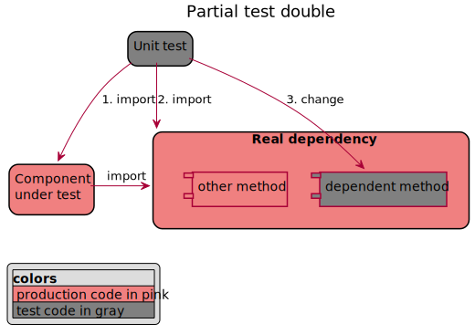

# Choose the best way to test double your nodeJS code

## Table of content

- [Choose the best way to test double your nodeJS code](#choose-the-best-way-to-test-double-your-nodejs-code)
  - [Table of content](#table-of-content)
  - [Are you mocking me?](#are-you-mocking-me)
  - [introduction](#introduction)
  - [Scope](#scope)
  - [0. Vocabulary](#0-vocabulary)
    - [General definition](#general-definition)
    - [Types of test double](#types-of-test-double)
    - [Test double in real life](#test-double-in-real-life)
  - [1. How you should organize your production code to make it easy to mock.](#1-how-you-should-organize-your-production-code-to-make-it-easy-to-mock)
  - [2. What you want to mock](#2-what-you-want-to-mock)
    - [2.1. Type of component to mock](#21-type-of-component-to-mock)
    - [2.2. Level of mocking](#22-level-of-mocking)
      - [Partial test double](#partial-test-double)
      - [Full test double](#full-test-double)
  - [3. Which mocking tool should I use?](#3-which-mocking-tool-should-i-use)
  - [4. Integrate the mocking tool in your solution](#4-integrate-the-mocking-tool-in-your-solution)
  - [References](#references)

## Are you mocking me?

== Vocabulary ==

Mock = test double in fact.

## introduction

== Crap:
Mocking your dependencies in order to test it is not so easy. You need to make some choices about:

1. How you should organize your production code to make it easy to mock.
2. Choose what you want to mock.
3. Choose the mocking library should I use?
4. Integrate the mocking tool in your solution


## Scope

My goal in this document is to answer to the most general question we can have when we want to create some tests double in Node.JS and have a code example for each framework.

## 0. Vocabulary

### General definition

Mock is sometimes used to refer to all type of **test doubles**, but in fact **mock** is just one type of test doubles.

Definition of Test doubles (from Wikipedia):

```
In automated unit testing, it may be necessary to use objects or procedures that look and behave like their release-intended counterparts, but are actually simplified versions that reduce the complexity and facilitate testing. A test double is a generic (meta) term used for these objects or procedures.
```

### Types of test double

Test doubles is a general term to refer to different type of objects. This list describe 5 of the most used by order of complexity: 

- Dummies: simple implementation of an interface. It's not intended to be used. It's not really useful in Javascript.
- spy: (or Test Spy) get information on dependency usage without changing the behavior. (Number of call, arguments)
- stub: (= Dummy + static implementation) test double with modification of the behavior in order to test your component.
- Fakes: (= stub + simple implementation)
- Mock: (= stub + internal test) test double which is aware about the test (with some test assertion for example).

**Be carful**: Mock as this type of specific type of test double built specifically for your test is in fact consider as an ___anti-pattern___ most of the time. It breaks the AAA (Arrange Act Assert) test structure. You should probably consider other types of test double before.

### Test double in real life

In javascript, __Dummies__ are not really useful because there is no need to implement any fixed interface. Therefore you'll never have to implement test doubles if it's not intended to be used in your component under test.

__Spies__ are non invasive test double provided by almost all the testing frameworks. You could technically implement a spy yourself but it's really not worth it.

__Stubs__ are invasive test double provided by almost all the testing frameworks. You could technically implement a stub yourself but it's really not worth it.

__Fakes__ are just smart stubs, their implementation is smarter and fully functional in contrast to a stub which have a very basic implementation (static most of the time). We'll consider Fakes and stub as one category.

__Mocks__ are just stubs with some awareness of your test. Mocks are not the first type of test double to consider. Sinon have special objects for this, on other frameworks you need to use stubs.

## 1. How you should organize your production code to make it easy to mock.

The basic structure of javascript is the module.
Your test should stay independent from internal details of the module.

```
In order to test your component in isolation, which dependencies do you need to replace?
```

Once you have identify those dependencies (functions, modules) they'll become the seams of your component. The seams are the places where two parts of the software meet and where something else can be injected/replaced.

In javascript the good ways to expose your seams are as

- 1. Module dependencies (to an other module or a package)
- 2. Function parameters (including constructor)

Of course, some tools can help you to modify some implementation details like [rewire
](https://github.com/jhnns/rewire) but using them to create your test is a very bad practice. It breaks the all the encapsulation principle and lead to a lot of problems. So the best practice is to stick to this 3 way of creating seams.

If to test your component you would need to replace an internal function, you need first to refactor your component to expose this function as a seam before thinking of mocking anything.

On top of this, intercept an internal function is tricky (To Explain)

## 2. What you want to mock

### 2.1. Type of component to mock

Depending of your component and your test case, you will be interested to mock different type of dependencies:

- some of your own dependencies
- some system dependencies

=> TO CHECK: Mocking everywhere or just my code !!!!

### 2.2. Level of mocking

Test doubles in javascript can be achieved at 2 different levels. Those 2 different level are often named Partial test double and full test double.

To remove: I propose to name them: POST-import test doubles and import-interception test doubles.

no-interception vs partial-testdouble

There is 2 types of libraries: stubbing library and module interception library.

- Sinon is simply a stubbing library. Only for simple cases.
- module interception library: solutions targeting link seams or explicit dependency injection
  - For module interception, the type of import is really important. Depending of your project the type of import is really important to choose your mock tool. [see this page](./summary-import-types.md)
  

[This very good article and project explain how it's tricky to make partial import in ES6](https://codewithhugo.com/jest-mock-spy-module-import/)


#### Partial test double



This is the only way to get a real spy and a simple ack to to get a stub (for stubs prefer Full test double).

Step by step:

1. Import your component under test (of course)
2. Import the component dependency
3. Replace each method dependency with your method spy or stub.

For this you just need a test doubles library. It's named __partial test double__ because you are keeping the behavior of all your dependency except the part you want to spy or stub. You can also name it 'test double without module interception'.

This is the way to go to spy your dependency. You can also stub it but partial stub is consider as an __anti-pattern__ (REF NEEDED), it's simple but could lead to some problems. (TO COMPLETE)

#### Full test double


This is the best way to stub your dependency in a clean way.
To make a full stub you need a javascript module interception library. (SEE Different options HERE...)

__Step by step__: The way to intercept the module dependency in your component under test will not be the same depending on the library but the only common point is that you SHOULD NOT import the component dependency directly.

See example with:
 [Jest](./jest-with-interception/test/moduleA.stub.spec.js),
 [proxyquire](./sinon-with-interception-proxyquire/test/moduleA.stub.spec.js),
 [rewire](./sinon-with-interception-rewire/test/moduleA.stub.spec.js),
 [rewiremock](./sinon-with-interception-rewiremock/test/moduleA.stub.spec.js),
 [testdouble](./testdouble-with-interception/test/moduleA.stub.spec.js),

It's named __full test double__ because you are not keeping anything of your original dependency behavior.

Spying in a __full test double__ is not possible, because by intercepting the javascript dependent module you are not  importing the original module at all. You have to stub it fully to be able to test your component.

## 3. Which mocking tool should I use?

There plenty of test libraries in javascript for different purpose. Some are made to be used together some not. See [Javascript test tools types overview](./js-test-tools-overview.md) for more details.

For Mocking purpose we'll be interested by only those types of tools: Test Doubles library and Module interception library.

## 4. Integrate the mocking tool in your solution

This collection of demo try to find the pro and cons of different approaches.

## References

[Understanding Test Doubles (Mock vs Stub)](https://adamcod.es/2014/05/15/test-doubles-mock-vs-stub.html)

[mocking ES and commonJS modules with jest mock](http://www.google.com)

[clean code](https://medium.com/codeclan)

[Please stop playing with proxyquire](https://dev.to/thekashey/please-stop-playing-with-proxyquire-11j4)
[Please stop playing with proxyquire](https://medium.com/@antonkorzunov/please-stop-playing-with-proxyquire-923fe6009a0a)
by the creator of rewiremock

[Sinon documentation](https://sinonjs.org/how-to/stub-dependency/)
